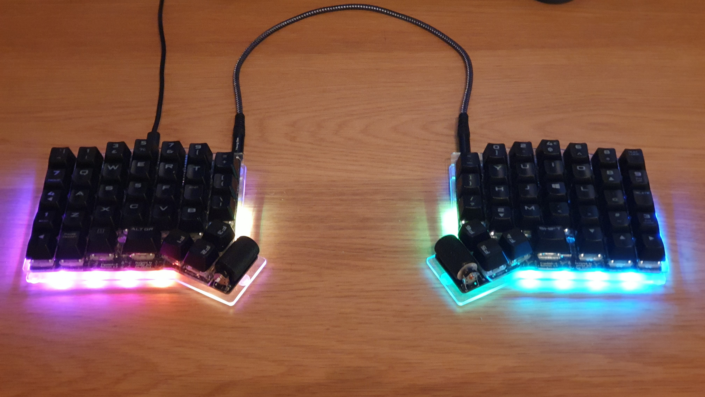

# ErgoDash-R

# Changes from original ErgoDash

- Added rotary encoder (scroll wheel) in place of the ErgoDash's optional outer thumb buttons
- Removed speaker to make pin available for rotary encoder
- Replaced firmware backlight control with physical toggle switch to make pin available for rotary encoder
- Replaced some parts with ones easier to obtain in the UK
- Added jumper pin positions for backlight switch and spare keyboard switch to allow adding functionality later

# Parts

[Parts List](doc/shoplist.ods)

# Firmware

The ErgoDash-R uses QMK for its firmware. It will need updating from the
original ErgoDash firmware here: [QMK - ErgoDash
directory](https://github.com/qmk/qmk_firmware/tree/master/keyboards/ergodash).
I have a working configuration myself, and will get around to publishing it
eventually.

# Build Guide

The build is very similar to the original ErgoDash, but there are a few
gotchas. I need to get around to writing these up.

[ErgoDash Build Guide](https://github.com/omkbd/ErgoDash/blob/master/Doc/build-en.md)
